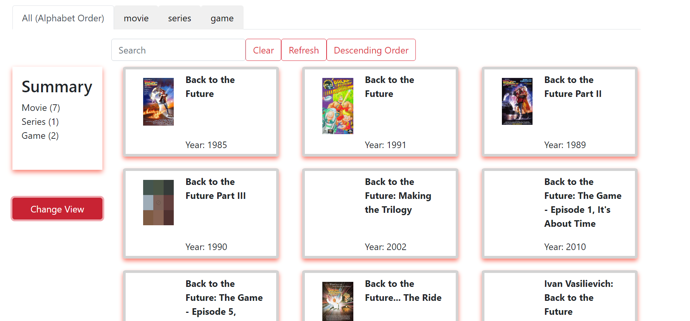
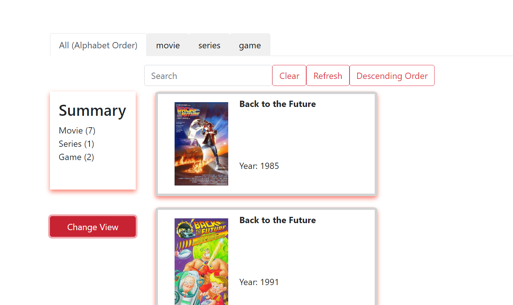
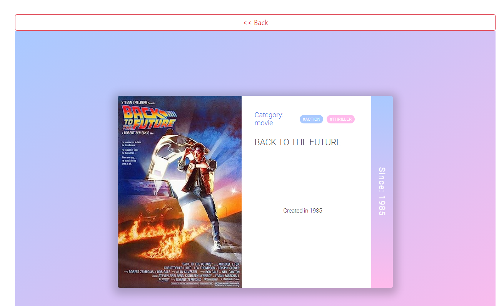

Basic web screen designed with React Framework, Redux and Redux-thunk middleware
###

Demo:

Grid View

List View

Movie Preview

###
Setup:
1. Set Environemnt Variables (.env)
  REACT_APP_DATA_PATH="data.json"
2. Run NPM Install
3. Run NPM Start
You Are Done!!
###
Author: Sara Greenblatt
